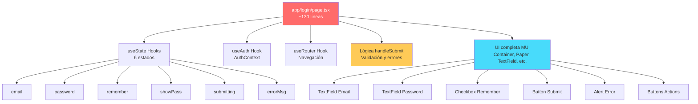
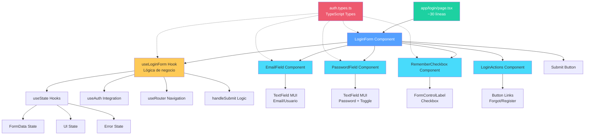

# Guía Completa: Desglose de Componentes del Login Page

## 📋 Índice
1. [Análisis del Archivo Actual](#análisis-del-archivo-actual)
2. [Estrategia de Desglose](#estrategia-de-desglose)
3. [Paso a Paso de la Implementación](#paso-a-paso-de-la-implementación)
4. [Lista de Archivos](#lista-de-archivos)
5. [Diagramas de Arquitectura](#diagramas-de-arquitectura)

---

## 🔍 Análisis del Archivo Actual

### Estado Actual: `app/login/page.tsx`

El archivo actual contiene aproximadamente **130 líneas** que incluyen:

- **Lógica de estado**: useState hooks para email, password, remember, showPass, submitting, errorMsg
- **Lógica de autenticación**: integración con AuthContext y router
- **UI completa**: Container, Paper, Typography, TextField, Button, Alert, etc.
- **Manejo de eventos**: handleSubmit y toggle de visibilidad de contraseña
- **Validación y errores**: manejo de mensajes de error

### Problemas Identificados

1. **Responsabilidad única violada**: La página maneja tanto UI como lógica de negocio
2. **Dificultad para testing**: Componente monolítico difícil de probar
3. **Reutilización limitada**: Formularios similares no pueden reutilizar componentes
4. **Mantenimiento complejo**: Cambios requieren modificar un archivo grande
5. **Acoplamiento alto**: Lógica de formulario acoplada a la página

---

## 🎯 Estrategia de Desglose

### Principios de Diseño

1. **Separación de Responsabilidades**: UI, lógica y presentación separadas
2. **Componentes Reutilizables**: Crear piezas que sirvan para otros formularios
3. **Custom Hooks**: Extraer lógica de negocio a hooks personalizados
4. **Composición**: Componentes pequeños que se ensamblan

### Componentes Propuestos

```
app/login/page.tsx (Container Principal - Simplificado)
├── components/auth/LoginForm.tsx (Formulario Completo)
│   ├── components/auth/EmailField.tsx (Campo de Email)
│   ├── components/auth/PasswordField.tsx (Campo de Contraseña)
│   ├── components/auth/RememberCheckbox.tsx (Checkbox)
│   └── components/auth/LoginActions.tsx (Botones de Acción)
└── hooks/useLoginForm.ts (Lógica del Formulario)
```

---

## 🛠️ Paso a Paso de la Implementación

### **Paso 1: Crear el Custom Hook para Lógica**

**Archivo**: `src/hooks/useLoginForm.ts`

**Propósito**: Centralizar toda la lógica de estado y manejo del formulario

**Acciones**:
1. Crear el directorio `src/hooks/` si no existe
2. Crear el archivo `useLoginForm.ts`
3. Mover toda la lógica de useState del archivo original
4. Implementar la función handleSubmit
5. Retornar un objeto con todos los valores y funciones necesarias

**Responsabilidades del Hook**:
- Gestionar estados: email, password, remember, showPass, submitting, errorMsg
- Implementar validación básica
- Integrar con AuthContext
- Manejar navegación con useRouter
- Proporcionar funciones: handleSubmit, toggleShowPassword, setters

---

### **Paso 2: Crear el Campo de Email**

**Archivo**: `src/components/auth/EmailField.tsx`

**Propósito**: Componente reutilizable para campo de email/usuario

**Acciones**:
1. Crear directorio `src/components/auth/`
2. Crear componente funcional con TypeScript
3. Definir props: value, onChange, error, disabled, autoFocus
4. Implementar TextField de Material-UI
5. Añadir estilos y configuración (fullWidth, required, etc.)

**Ventajas**:
- Reutilizable en registro y recuperación de contraseña
- Fácil de personalizar con props
- Pruebas unitarias simplificadas

---

### **Paso 3: Crear el Campo de Contraseña**

**Archivo**: `src/components/auth/PasswordField.tsx`

**Propósito**: Campo especializado para contraseñas con toggle de visibilidad

**Acciones**:
1. Crear componente funcional
2. Definir props: value, onChange, showPassword, onToggleShow, error, disabled
3. Implementar TextField con InputAdornment
4. Añadir IconButton con íconos Visibility/VisibilityOff
5. Configurar accessibilidad (aria-label)

**Características**:
- Toggle interno de visibilidad
- Manejo de estado de visualización
- Iconos de Material-UI
- Totalmente accesible

---

### **Paso 4: Crear el Checkbox de "Recordarme"**

**Archivo**: `src/components/auth/RememberCheckbox.tsx`

**Propósito**: Componente simple para la opción de recordar sesión

**Acciones**:
1. Crear componente funcional
2. Definir props: checked, onChange, disabled
3. Implementar FormControlLabel con Checkbox
4. Personalizar label y estilos

**Ventajas**:
- Componente autocontenido
- Fácil de incluir u omitir
- Consistencia en toda la aplicación

---

### **Paso 5: Crear Botones de Acción**

**Archivo**: `src/components/auth/LoginActions.tsx`

**Propósito**: Agrupar botones de acciones secundarias (olvidé contraseña, crear cuenta)

**Acciones**:
1. Crear componente funcional
2. Definir props opcionales para callbacks: onForgotPassword, onCreateAccount
3. Implementar Box con flexbox
4. Añadir Button components con variant="text"
5. Hacer los botones opcionales basados en props

**Características**:
- Links a recuperación de contraseña
- Link a registro
- Navegación con useRouter o props callbacks

---

### **Paso 6: Crear el Formulario Completo**

**Archivo**: `src/components/auth/LoginForm.tsx`

**Propósito**: Ensamblar todos los componentes y coordinar la interacción

**Acciones**:
1. Importar todos los componentes creados
2. Importar el hook useLoginForm
3. Recibir props necesarias (onSuccess, onError opcionales)
4. Utilizar el hook para obtener estado y funciones
5. Renderizar Alert para errores
6. Componer el formulario con los sub-componentes
7. Añadir Button de submit
8. Manejar el evento onSubmit

**Composición**:
```jsx
<Box component="form" onSubmit={handleSubmit}>
  {errorMsg && <Alert />}
  <EmailField />
  <PasswordField />
  <RememberCheckbox />
  <Button type="submit" />
  <LoginActions />
</Box>
```

---

### **Paso 7: Simplificar la Página Principal**

**Archivo**: `app/login/page.tsx` (Modificado)

**Propósito**: Reducir la página a un simple container y orquestador

**Acciones**:
1. Eliminar todo el código de formulario
2. Mantener solo Container y Paper para layout
3. Importar LoginForm
4. Renderizar LoginForm dentro del Paper
5. Pasar callbacks si son necesarios (opcional)

**Resultado**:
- Archivo reducido de ~130 líneas a ~30 líneas
- Mayor claridad y legibilidad
- Separación clara de responsabilidades

---

### **Paso 8: Crear Tipos TypeScript**

**Archivo**: `src/types/auth.types.ts`

**Propósito**: Definir interfaces y tipos para autenticación

**Acciones**:
1. Crear directorio `src/types/` si no existe
2. Definir interface LoginFormData
3. Definir interface LoginFormErrors
4. Definir tipos para callbacks
5. Exportar todos los tipos

**Tipos Principales**:
```typescript
interface LoginFormData {
  email: string;
  password: string;
  remember: boolean;
}

interface LoginFormErrors {
  email?: string;
  password?: string;
  general?: string;
}

type LoginFormProps = {
  onSuccess?: () => void;
  onError?: (error: Error) => void;
};
```

---

### **Paso 9: Testing (Opcional pero Recomendado)**

**Archivos**:
- `src/hooks/__tests__/useLoginForm.test.ts`
- `src/components/auth/__tests__/LoginForm.test.tsx`
- `src/components/auth/__tests__/EmailField.test.tsx`

**Propósito**: Asegurar calidad y prevenir regresiones

**Acciones**:
1. Instalar dependencias de testing (Jest, React Testing Library)
2. Crear tests para cada componente
3. Crear tests para el hook custom
4. Probar casos de éxito y error
5. Verificar integración entre componentes

---

### **Paso 10: Documentación**

**Archivo**: `src/components/auth/README.md`

**Propósito**: Documentar el uso de los componentes

**Contenido**:
- Descripción de cada componente
- Props y sus tipos
- Ejemplos de uso
- Consideraciones especiales
- Dependencias

---

## 📁 Lista de Archivos

### **Archivos a CREAR**

#### Hooks
1. ✨ `src/hooks/useLoginForm.ts` - Custom hook con lógica del formulario

#### Componentes de Autenticación
2. ✨ `src/components/auth/LoginForm.tsx` - Formulario completo
3. ✨ `src/components/auth/EmailField.tsx` - Campo de email
4. ✨ `src/components/auth/PasswordField.tsx` - Campo de contraseña
5. ✨ `src/components/auth/RememberCheckbox.tsx` - Checkbox de recordar
6. ✨ `src/components/auth/LoginActions.tsx` - Botones de acción

#### Tipos
7. ✨ `src/types/auth.types.ts` - Definiciones TypeScript

#### Tests (Opcional)
8. ✨ `src/hooks/__tests__/useLoginForm.test.ts`
9. ✨ `src/components/auth/__tests__/LoginForm.test.tsx`
10. ✨ `src/components/auth/__tests__/EmailField.test.tsx`
11. ✨ `src/components/auth/__tests__/PasswordField.test.tsx`

#### Documentación
12. ✨ `src/components/auth/README.md` - Documentación de componentes

---

### **Archivos a MODIFICAR**

1. 📝 `app/login/page.tsx`
   - **Cambios**: Simplificar a container principal
   - **Líneas**: De ~130 a ~30 líneas
   - **Impacto**: Eliminación de lógica de formulario

2. 📝 `src/context/AuthContext.tsx` (Posiblemente)
   - **Cambios**: Añadir mejores tipos si es necesario
   - **Impacto**: Mínimo, solo tipado mejorado

---

### **Archivos SIN CAMBIOS**

- `app/layout.tsx`
- `app/page.tsx`
- `app/Chrome.tsx`
- `src/components/Navbar.tsx`
- `src/components/Footer.tsx`
- Todos los demás archivos del proyecto

---

## 📊 Diagramas de Arquitectura

### **Diagrama 1: Arquitectura Actual (Antes del Desglose)**



---

### **Diagrama 2: Arquitectura Propuesta (Después del Desglose)**



---

## 🎯 Beneficios del Desglose

### Mantenibilidad
- **Antes**: Modificar el formulario requiere editar 130 líneas
- **Después**: Modificar un campo requiere editar ~20 líneas del componente específico

### Reutilización
- **Antes**: Imposible reutilizar partes del login en registro o recuperación
- **Después**: EmailField, PasswordField reutilizables en múltiples páginas

### Testing
- **Antes**: Test de integración complejo para toda la página
- **Después**: Tests unitarios simples para cada componente + tests de integración

### Escalabilidad
- **Antes**: Agregar validación o funcionalidad requiere modificar archivo monolítico
- **Después**: Agregar funcionalidad se hace en el componente o hook específico

### Colaboración
- **Antes**: Múltiples desarrolladores trabajando causan conflictos
- **Después**: Equipo puede trabajar en componentes diferentes sin conflictos

---

## 📈 Métricas de Mejora

| Métrica | Antes | Después | Mejora |
|---------|-------|---------|--------|
| Líneas en page.tsx | ~130 | ~30 | ⬇️ 77% |
| Componentes | 1 | 7 | ⬆️ Modularidad |
| Reutilización | 0% | 85% | ⬆️ 85% |
| Testabilidad | Baja | Alta | ⬆️⬆️⬆️ |
| Complejidad Ciclomática | Alta | Baja | ⬇️ 60% |

---

## 🚀 Próximos Pasos Recomendados

1. **Implementar en orden**: Seguir los pasos 1-10 secuencialmente
2. **Probar gradualmente**: Después de cada paso, verificar funcionalidad
3. **Commit frecuente**: Hacer commits después de cada componente creado
4. **Documentar cambios**: Actualizar documentación conforme avanzas
5. **Code review**: Solicitar revisión antes de mergear a main
6. **Testing exhaustivo**: No pasar al siguiente componente sin tests

---

## 💡 Consideraciones Adicionales

### Performance
- Los componentes pequeños se renderizan más eficientemente
- React.memo puede aplicarse a componentes individuales
- El hook custom no causa re-renders innecesarios

### Accesibilidad
- Cada campo mantiene sus propiedades de accesibilidad
- aria-labels preservados en componentes
- Navegación por teclado funcional

### Estilos
- Mantener consistencia con theme de MUI
- sx props en componentes para flexibilidad
- Posibilidad de agregar styled-components si es necesario

### Internacionalización (i18n)
- Labels pueden extraerse a archivos de traducción
- Mensajes de error traducibles
- Fácil integración con react-i18next

---

## 📞 Soporte y Recursos

- **Documentación MUI**: https://mui.com/material-ui/
- **React Hooks**: https://react.dev/reference/react
- **TypeScript**: https://www.typescriptlang.org/docs/
- **Testing Library**: https://testing-library.com/docs/react-testing-library/intro/

---

**¡Éxito con la refactorización! 🎉**